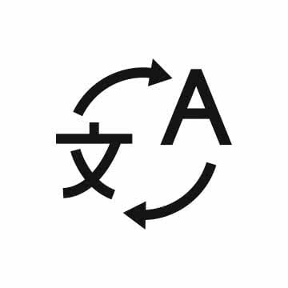

# Swift Translate

A sleek, ultra-responsive, and instantaneous web translation application built with React and modern Vanilla CSS. **Swift Translate** provides real-time, zero-reload translations with speech recognition, text-to-speech pronunciation, intelligent multi-engine fallback, and a clean glassmorphic aesthetic designed for seamless global communication.

---

## Features

- 🚀 **Real-Time Translation**: Instantaneous translation as you select languages or swap translation pairs with zero race conditions.
- 🎙️ **Speech Recognition & Pronunciation**: Dictate text directly via the Web Speech Recognition API and listen to native voice pronunciation (`volume_up`) with customizable speech rates (Normal, Slow, Slower).
- 🔄 **Intelligent Multi-Engine Fallback**: Powered primarily by `google-translate-api-browser` via CORS proxies, with automatic chaining to `MyMemory Neural Translation API` and offline simulation ensuring the application never crashes or stalls.
- 🎨 **Glassmorphism & Dark Mode**: Modern dark-mode-first aesthetic with dynamic micro-animations, customizable theme toggling, and rich HSL color tokens.
- 📱 **Zero-Scroll Responsive Layout**: Bento-grid layout optimized specifically for desktop (`1366x768`), tablet, and mobile breakpoints with dedicated bottom tab navigation.
- ⭐ **Persistent History & Favorites**: Automatically stores up to 50 recent translation items in `localStorage` and allows pinning/starring essential phrases for quick access.

---

## Tech Stack

- **Frontend Framework**: React 19 (Hooks, `useCallback`, `useMemo`, `useRef`, `React.memo`)
- **Styling Architecture**: Vanilla CSS with custom design system tokens (`index.css`), responsive Bento Grid (`App.css`), and zero external CSS frameworks.
- **Translation Engines**:
  - `google-translate-api-browser` (Primary CORS proxy engine)
  - `MyMemory Neural Translation API` (Secondary fallback engine)
  - Offline Simulation Engine (Graceful degradation)
- **Browser APIs**: Web Speech API (`SpeechRecognition` & `SpeechSynthesisUtterance`), Web Share API (`navigator.share`), Clipboard API (`navigator.clipboard`), and LocalStorage API.
- **Testing & Tooling**: Jest, React Testing Library, Create React App 5 (`react-scripts`).

---

## Installation

### Prerequisites
- [Node.js](https://nodejs.org/) (v16 or higher recommended)
- `npm` or `yarn`

### Quick Start

1. **Clone the repository:**
   ```bash
   git clone https://github.com/YOUR-USERNAME/Swift-Translate.git
   cd Swift-Translate
   ```

2. **Install dependencies:**
   ```bash
   npm install
   ```

3. **Start the development server:**
   ```bash
   npm start
   ```
   Open [http://localhost:3000](http://localhost:3000) to view the application in your browser.

4. **Run the test suite:**
   ```bash
   npm test -- --watchAll=false
   ```

5. **Create a production build:**
   ```bash
   npm run build
   ```

---

## Folder Structure

```
Swift-Translate/
├── public/
│   ├── favicon.ico
│   ├── index.html
│   ├── manifest.json
│   └── translate.jpg            # Header brand illustration
├── src/
│   ├── components/
│   │   ├── BottomNavBar.jsx     # Mobile bottom navigation tabs
│   │   ├── HeroSection.jsx      # Title and subtitle banner
│   │   ├── HistorySidebar.jsx   # Slide-in drawer for recent & starred items
│   │   ├── LanguageBar.jsx      # Language dropdown selector & swap button
│   │   ├── SourceCard.jsx       # Source input card with speech recognition & clear
│   │   ├── TargetCard.jsx       # Output card with TTS speech synthesis & sharing
│   │   └── TopNavBar.jsx        # Header with theme toggle, history toggle, & settings
│   ├── App.css                  # Component layout, Bento Grid, & responsive breakpoints
│   ├── App.js                   # Core state management & translation engine logic
│   ├── App.test.js              # Jest automated test suite
│   ├── index.css                # Global design system tokens, typography, & reset
│   ├── index.js                 # React DOM application entry point
│   ├── reportWebVitals.js       # Performance monitoring
│   └── setupTests.js            # Jest & Testing Library setup
├── EXPLANATION.md               # Complete architecture & explanation guide
├── LINE_BY_LINE_EXPLANATION.md  # Detailed line-by-line documentation
├── package.json                 # Project dependencies & scripts
└── README.md                    # Project documentation
```

---

## How It Works

1. **Centralized State Hub (`App.js`)**: All core state (languages, text input, translation output, theme preference, voice speed, and history) is managed inside `App.js`.
2. **Race-Condition-Proof Translation Pipeline**: When translation is triggered, a sequence ID tracker (`requestIdRef`) checks that async network responses match the currently active request, preventing stale API outputs from overwriting newer user selections.
3. **Multi-Engine Resiliency**: The application attempts translation via `google-translate-api-browser` (`https://corsproxy.io/?`). If rate-limited or blocked, it transparently chains to the `MyMemory API` (`https://api.mymemory.translated.net/get`), and finally falls back to local simulation (`[TargetLangName] text`) if offline.
4. **Optimized Component Tree**: Pure presentation components (`TopNavBar`, `HeroSection`, `LanguageBar`, `BottomNavBar`, `TargetCard`) are memoized via `React.memo` and receive `useCallback` memoized handlers, ensuring zero lag during rapid typing or dictation.
5. **Persistent Storage**: Theme settings, pronunciation speed, and translation history (`localStorage`) sync automatically across user sessions.

---

## Future Improvements

- **Offline Progressive Web App (PWA)**: Full Service Worker caching and local WebAssembly translation models (e.g., ONNX / MarianMT) for true zero-network offline translation.
- **Document Translation**: Drag-and-drop support for `.txt`, `.pdf`, and `.docx` file translation with layout preservation.
- **Conversation Mode**: Split-screen real-time bilingual voice conversation interface for travelers.
- **Custom Dictionary & Glossary**: User-defined terminology replacement rules for technical or industry-specific translations.

---

## Screenshots

| Desktop Bento Grid & Dark Mode | Mobile Responsive Layout & Drawer |
| :---: | :---: |
|  | *Clean mobile tabs and slide-in drawer* |

---

## License

This project is licensed under the **MIT License**. See the `LICENSE` file for details.
